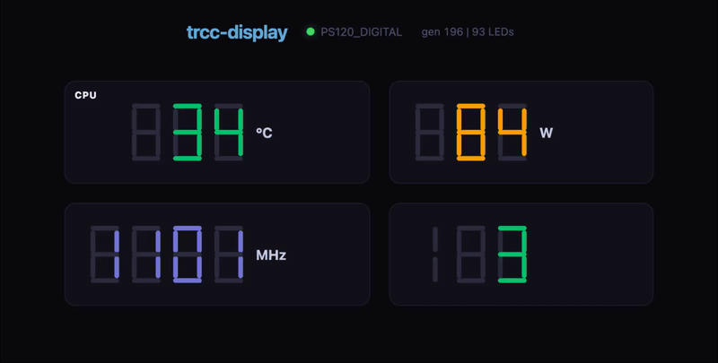

# trcc-display

Drive **Thermalright "Digital" cooler LED/segment displays** (USB `0416:8001` —
Phantom Spirit 120 Digital EVO, AX120/PA120 Digital, Assassin X Digital, …) from
live metrics.

It is a small, self-contained Rust reimplementation of the LED wire protocol
(the same one [`trcc-linux`](https://github.com/Lexonight1/thermalright-trcc-linux)
speaks). No Python, no GUI, no system libusb at runtime (libusb is vendored into
the binary). Values come from **Prometheus** or the local **`sensors -j`**
(lm-sensors) output; the display can run **headless** or be driven over a small
**REST API** (with an optional live web preview).

> These coolers are RGB **7-segment** displays — they show a *number* (plus a
> unit marker and colour), not an arbitrary image. This tool renders numbers.

---

## Features

<p align="center">
  
  
</p>

- **Three metric sources** — Prometheus (PromQL), `sensors -j` (local lm-sensors), or a built-in `Simulator` for testing without hardware.
- **Headless or REST** — run as a silent daemon, or expose an HTTP control surface to set values, push raw frames, blank the screen, or hot-reload config.
- **Live web preview** — optional embedded dashboard at `/` that mirrors the display in real time (7-segment digits, real RGB colours, zero external dependencies).
- **Data-driven device profiles** — LED geometry (digit maps, unit markers, wire remap) lives in JSON; add a new cooler without touching Rust.
- **Robust USB** — auto-detect, reconnect on unplug, and a probe cache for the "handshake answers only once per power cycle" firmware quirk.
- **Strict quality bar** — `unsafe` forbidden, `clippy` denied, extensive unit + integration tests.
- **Runs anywhere** — native binary, `systemd` unit, or Docker with a mapped USB device. Statically links `libusb` for maximum portability.

## How it works

```text
  metric source ──▶ engine ──▶ render ──▶ protocol ──▶ usb worker ──▶ cooler
  (prometheus |     (loop +    (7-seg     (packet      (libusb, own
   sensors -j |      overrides)  digits)    framing)     thread)
   simulator)           │
        ▲              │
   REST API (optional) sets     live web preview polls
   overrides / raw frames       the latest frame
```

The **engine** ticks a few times a second: it refreshes metric values on a
cadence, applies any REST overrides, rotates tiles that share a display slot,
renders a frame, and hands the packet to a dedicated **USB worker** thread.

---

## Quick start

### Build

```bash
# Rust via https://rustup.rs
cargo build --release
./target/release/trcc-display --help
```

### Run it

```bash
# Prometheus-backed, with REST API (edit config/config.json first):
trcc-display --config config/config.json run

# Fully local: read `sensors -j`, no Prometheus, no API:
trcc-display --config config/config.sensors.json run

# With live web preview (open http://localhost:9110/):
trcc-display --config config/config.json run
# (set "api": { "preview_enabled": true } in config)
```

### Docker

```bash
docker compose up -d --build   # maps /dev/bus/usb into the container
```

### Install a release binary

Download pre-built binaries from [GitHub Releases](https://github.com/dipenpradhan/trcc-display/releases).

```bash
# x86_64 Linux (statically linked, no system libusb needed)
tar xzf trcc-display-x86_64-linux.tar.gz
cp trcc-display /usr/local/bin/

# aarch64 Linux (Raspberry Pi, etc.)
tar xzf trcc-display-aarch64-linux.tar.gz
cp trcc-display /usr/local/bin/
```

Verify: `trcc-display --help`

---

## Configuration (`config.json`)

All config is JSON. Unknown keys (like `$comment`) are ignored, so the file can
document itself.

| Section      | Key                | Meaning |
|--------------|--------------------|---------|
| `usb`        | `vendor_id` / `product_id` | Decimal USB IDs (`0x0416`=1046, `0x8001`=32769). |
|              | `interface`        | HID interface number (usually `0`). |
| `profile`    | `dir`              | Directory of profile JSON files. |
|              | `force`            | Skip PM auto-detect and force a profile by name (`"pa120"`, `"ps120"`, …). |
| `source`     | `kind`             | `"prometheus"` or `"sensors"`. |
|              | `sensors_command`  | argv for the sensors source (default `["sensors","-j"]`). |
| `prometheus` | `url` / `timeout_seconds` | Prometheus base URL. |
| `api`        | `enabled`          | Set `false` for a headless daemon (no HTTP listener). |
|              | `bind`             | Bind address (default `0.0.0.0:9110`). |
|              | `preview_enabled`  | When `true`, serves a live LED preview at `/`. |
| `render`     | `refresh_seconds`  | How often to re-query the source. |
|              | `rotate_seconds`   | When several tiles share a slot, seconds per tile. |
|              | `tick_ms`          | Frame cadence. |
|              | `temp_unit`        | `"C"` or `"F"` (Celsius tiles auto-convert). |
|              | `indicator_color`  | `[r,g,b]` for always-on / unit LEDs. |
| `tiles`      | array              | What to display — see below. |

### Tiles

Each tile is one number shown in one **slot**. Tiles that target the *same* slot
are **rotated** through it; tiles in *distinct* slots show simultaneously (e.g.
the PA120's four fields).

```json
{
  "name": "gpu_temp",
  "slot": "gpu_temp",
  "query": "max(DCGM_FI_DEV_GPU_TEMP)",
  "unit": "celsius",
  "color": [0, 200, 120],
  "warn": 75,
  "crit": 84,
  "indicators": []
}
```

- `query` — **PromQL** for the prometheus source, or a **`chip/feature[/subfeature]`**
  selector for the sensors source (e.g. `k10temp-pci-00c3/Tctl/temp1_input`, or
  `amdgpu-pci-1200/edge` to take the first `*_input` reading of a feature).
- `unit` — marker LED to light: `celsius` / `fahrenheit` / `percent`.
- `color` / `warn` / `crit` — base colour, amber at/above `warn`, red at/above `crit`.

## Metric sources

**Prometheus** — each tile `query` is an instant PromQL query; the first series'
value is displayed.

**lm-sensors** — the driver runs `sensors -j` once per refresh and selects each
tile's value from the JSON tree. This needs no network and no REST API; pair it
with `api.enabled:false` for a self-contained local driver (see
`config/config.sensors.json`).

---

## REST API

Enabled when `api.enabled:true` (default bind `0.0.0.0:9110`).

| Method & path         | Body / effect |
|-----------------------|---------------|
| `GET  /health`        | `ok` |
| `GET  /status`        | connection, profile, source, per-tile values + errors |
| `GET  /config`        | current config file |
| `POST /reload`        | re-read config (tiles/render live-apply; source/url/bind need restart) |
| `POST /display/value` | `{"slot","value","unit"?,"color"?[3],"ttl_seconds"?}` — override a slot |
| `POST /display/raw`   | `{"colors":[[r,g,b],…],"ttl_seconds"?}` — push a full frame (must be exactly the profile's LED count) |
| `POST /display/off`   | `{"ttl_seconds"?}` — blank the screen |
| `POST /display/clear` | drop all overrides, resume metrics |

### Live web preview

When `api.preview_enabled:true`, an extra set of routes is served under `/`:

| Method & path        | Effect |
|----------------------|--------|
| `GET  /`             | Self-contained HTML dashboard (7-segment digits, real RGB colours). |
| `GET  /frame`        | JSON: `{ generation, profile, leds: [[r,g,b], …] }` |

The page polls `/preview/frame` at 4 Hz and renders the same 7-segment layout
the cooler displays. Zero external dependencies — the HTML/CSS/JS is embedded
at compile time.

```bash
curl -s localhost:9110/status | jq
curl -s -XPOST localhost:9110/display/value \
  -H 'content-type: application/json' \
  -d '{"slot":"gpu_temp","value":72,"unit":"celsius","color":[255,60,60],"ttl_seconds":30}'
```

## CLI

```text
trcc-display [--config <path>] [-v|-vv] <command>

  run            Run the driver (default): refresh, render, serve REST.
  detect         List connected devices matching the USB VID/PID.
  probe          Handshake and print identity + resolved profile.
  once           Fetch metrics once, render a single frame, exit.
  render         Render one explicit value: --config config/config.json --slot gpu_temp --value 63 --unit celsius --color 255,60,60
  test-pattern   Map the LEDs: --mode walk|all --color r,g,b --delay-ms N (walk lights one LED at a time)
```

`-v` = debug, `-vv` = trace; `RUST_LOG` overrides. Errors print the full context
chain.

---

## Device profiles

A profile is pure geometry, loaded from `config/profiles/*.json`. Shipped:

- **`ax120.json`** — `AX120_DIGITAL` family: 30 LEDs, one 3-digit field.
- **`pa120.json`** — `PA120_DIGITAL` family: 84 LEDs, four simultaneous fields
  (`cpu_temp`, `cpu_use`, `gpu_temp`, `gpu_use`).
- **`ps120.json`** — `PS120_DIGITAL` family (Phantom Spirit 120 Digital EVO):
  93 LEDs, four simultaneous fields (`temp`, `watt`, `mhz`, `use`).

The **Phantom Spirit 120 Digital EVO** reports PM bytes `48` or `49` over its
handshake — run `trcc-display probe` to see which profile it maps to. If it
maps to neither, `test-pattern --mode walk` lights one LED at a time so you can
map its digits and write a new profile JSON. Fields:

```jsonc
{
  "name": "MY_COOLER", "style": "mycooler",
  "pm_bytes": [3],            // handshake PM values that select this profile
  "mask_size": 30,            // total LED count
  "remap": null,              // optional physical<-logical wire table
  "always_on": [0, 1],        // LEDs always lit (unit frame)
  "indicators": { "cpu": [2,3] },
  "slots": {
    "main": {
      "digits": [[9,10,11,12,13,14,15], ...],   // 7 LEDs per digit, order a..g
      "partial": null,                          // optional hundreds '1'
      "unit": { "celsius": 6, "percent": 8 }
    }
  }
}
```

---

## Development

The project is developed with builds on a fast Linux box and hardware tests on
the machine with the display attached:

```bash
# Build + lint + test (strict mode)
cargo build --all-targets
cargo clippy --all-targets --all-features -- -D warnings
cargo test
cargo fmt --check
```

Strict mode is enforced via the `[lints]` table in `Cargo.toml`: `unsafe_code`
is **forbidden**, the full `clippy` suite is **denied**, and `pedantic` is on.

### Continuous integration

GitHub Actions runs on every push and PR:

| Job | What it does |
|-----|-------------|
| **Test (stable)** | `cargo fmt --check`, `cargo build --all-targets`, `cargo test`, `cargo build --release` |
| **Clippy (pedantic)** | `cargo clippy --all-targets --all-features -- -D warnings` |
| **Build aarch64** | Cross-compile for ARM64 (no USB hardware needed) |

### Releases

Tag a commit with `vX.Y.Z` and the release workflow builds:
- Stripped x86_64 and aarch64 binaries (GitHub Release with SHA-256 checksums)
- Docker image pushed to GHCR with semver, minor, and `latest` tags

## Deployment

- **systemd** — see `packaging/systemd/trcc-display.service` and the udev rule in
  `packaging/udev/` for non-root USB access.
- **Docker** — see `Dockerfile` / `docker-compose.yml`. libusb is vendored, so
  the runtime image needs no libusb; map `/dev/bus/usb` in.

## License

Apache-2.0 — see [LICENSE](LICENSE) and [NOTICE](NOTICE). The USB protocol was
derived for interoperability from the `trcc-linux` project; this is an
independent clean-room reimplementation and is not affiliated with Thermalright.